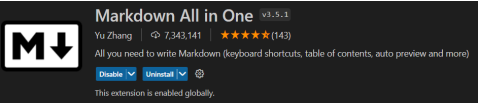

# Proyecto de despliegue de aplicaciones 

## Esto es una actividad del ciclo superior de Desarrollo de Aplicaciones Web _(DAW)_

Centro: [**IES Abastos**](https://portal.edu.gva.es/iesabastos/es/centre/)

---

# Objetivos de la actividad

- Utilizar markdown
- Subir un repositorio a github
- Utilizar sistemas de gestion de versiones

**Extensión usada para ver el markdown:**
    

### Código del markdown:
```markdown
# Proyecto de despliegue de aplicaciones 

## Esto es una actividad del ciclo superior de Desarrollo de Aplicaciones Web _(DAW)_

Centro: [**IES Abastos**](https://portal.edu.gva.es/iesabastos/es/centre/)

---

# Objetivos de la actividad

- Utilizar markdown
- Subir un repositorio a github
- Utilizar sistemas de gestion de versiones

**Extensión usada para ver el markdown:**
    
```